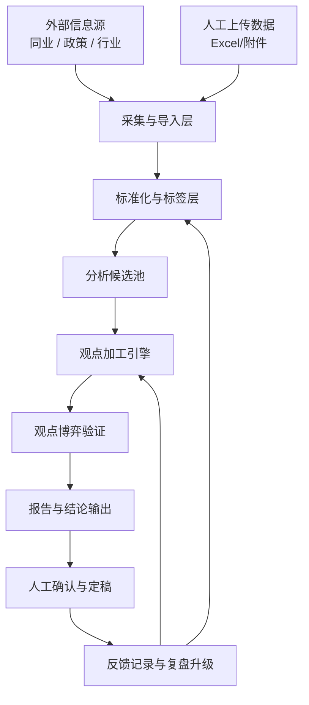

# 对公 AI 雷达站架构设计 v0.1

## 1. 总体目标

构建一个可配置、可升级的人机协同经营情报系统，支持同业、政策、行业三大信息源的持续输入，完成分类、加工、验证、输出与复盘，形成服务于公司业务经营决策的雷达大脑。

## 2. 总体架构分层



## 3. 核心模块

### 3.1 数据采集与导入层

职责：
- 外部公开信息采集
- Excel / 附件导入
- 数据解析与预处理
- 来源信息记录

首期重点：
- 人工上传对标数据导入
- 政策/行业信息半自动采集接口预留

### 3.2 标准化与标签层

职责：
- 来源分类：同业 / 政策 / 行业
- 板块分类：整体 / 存款 / 贷款
- 影响对象分类：产品 / 行业 / 定价 / 竞争 / 策略
- 重要度、时效性、可信度评分

### 3.3 分析候选池

职责：
- 承接所有原始候选信息
- 不直接进入正式输出
- 作为观点加工前的筛选池

### 3.4 观点加工引擎

职责：
- 摘要提炼
- 事实归纳
- 趋势判断
- 对整体/存款/贷款影响分析
- 策略建议生成
- 行动建议草稿生成

### 3.5 观点博弈验证

职责：
- 支持证据归集
- 反向证据归集
- 不确定性标注
- 人工待确认点生成

### 3.6 报告输出层

支持输出：
- 周报
- 专题报告
- 观点池
- 同业动态池
- 政策影响池
- 行业趋势池

### 3.7 反馈与升级层

职责：
- 记录人工修改前后差异
- 记录采纳 / 驳回
- 归纳偏好与表达习惯
- 为模型与规则升级提供依据

## 4. 首期技术建议

### 4.1 仓库结构建议

```text
projects/ai-radar-station/
  docs/
  apps/
    web/
    api/
  packages/
    core/
    ingestion/
    analysis/
    reports/
  data/
    raw/
    processed/
  scripts/
```

### 4.2 技术原则

- 原型期强调可快速迭代
- 配置、数据源、模板、规则尽量解耦
- 优先支持 Excel/附件导入
- 保留后续迁移到可信环境的能力
- 避免把凭据、路径、任务调度写死在代码中

## 5. 可信环境迁移要求

后续迁移时应分离：
- 代码
- 配置
- 凭据
- 数据连接
- 调度任务
- 用户权限
- 审计日志

原型环境负责快速验证，可信环境负责生产化运行。
